# 🛒 E-Commerce Mobile App


A full-stack, feature-rich mobile e-commerce application built with **React Native (Expo)** on the frontend and **Node.js (Express) + MongoDB** on the backend. This project utilizes modern tools like **NativeWind** for styling, **Expo Router** for file-based navigation, and **Clerk** for robust authentication.

---

## ✨ Features

- **📱 Beautiful Mobile UI:** Styled with NativeWind (Tailwind CSS) for a modern, responsive feel.
- **🔐 Secure Authentication:** Seamless sign-up, sign-in, and MFA via Clerk.
- **🛍️ Product Browsing:** View product catalogs, search, and pagination.
- **🛒 Shopping Cart & Checkout:** Manage cart items and simulate checkout flows.
- **❤️ Wishlist:** Save favorite products for later.
- **📦 Order Management:** View past orders and order details.
- **⚙️ Admin Dashboard (UI):** Admin screens for product and order management.
- **☁️ Cloudinary Integration:** Image uploading and management.
- **🔄 Webhooks:** Real-time data syncing with Svix.

---

## 🛠️ Tech Stack

### Client App (Frontend)
- **Framework:** Expo SDK 54 & React Native
- **Navigation:** Expo Router (File-based routing)
- **Styling:** NativeWind (Tailwind CSS for React Native)
- **State Management:** React Context (Cart & Wishlist)
- **Authentication:** Clerk (`@clerk/expo`)
- **Notifications:** React Native Toast Message

### Server (Backend)
- **Runtime & Framework:** Node.js, Express.js (v5)
- **Language:** TypeScript
- **Database:** MongoDB (Mongoose)
- **Authentication:** Clerk (`@clerk/express`)
- **File Uploads:** Multer & Cloudinary
- **Security:** Helmet, CORS, Express Rate Limit
- **Webhooks:** Svix

---

## 📸 Screenshots

### Customer View

The screenshots below represent the normal customer experience. This is separate from the admin dashboard and covers the complete shopping journey in the mobile app.

| Home | Favorites | Cart | Profile |
| :---: | :---: | :---: | :---: |
| 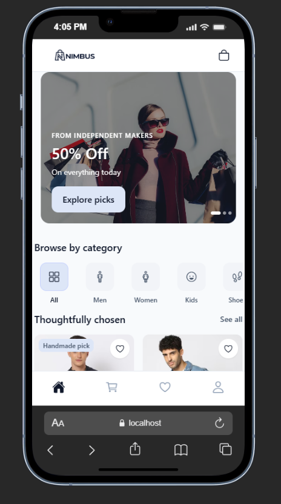 | 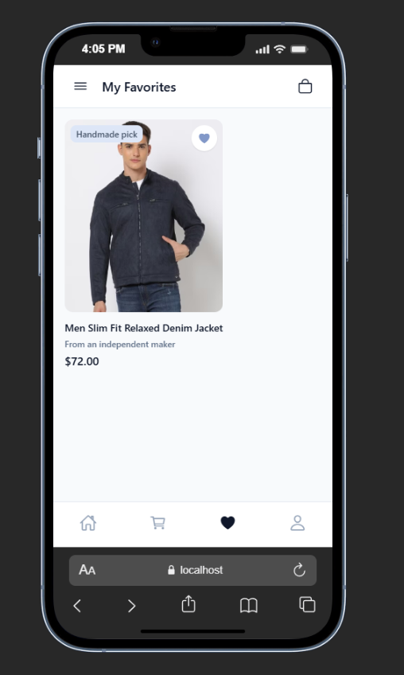 | 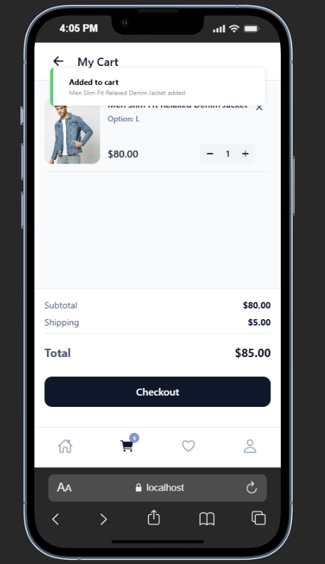 | 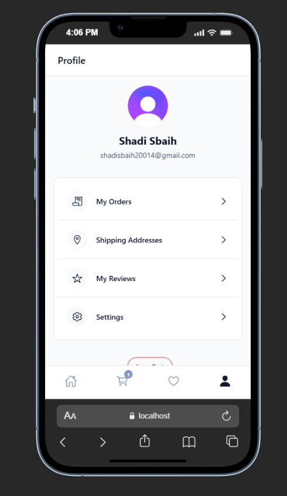 |

| Product Details | My Orders | Shipping Addresses |
| :---: | :---: | :---: |
| 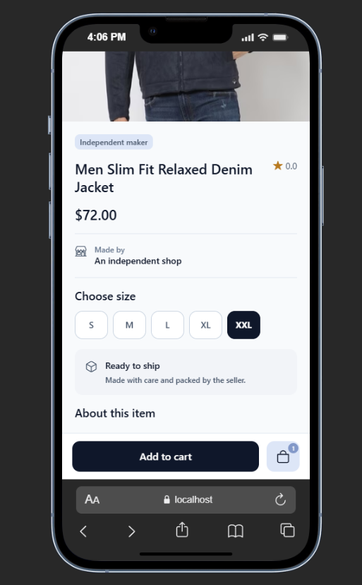 | 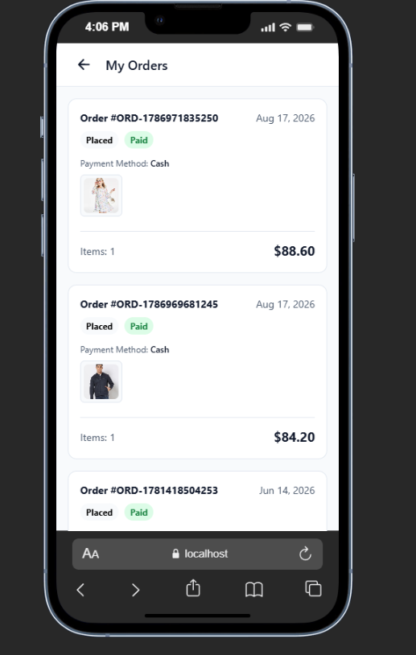 | 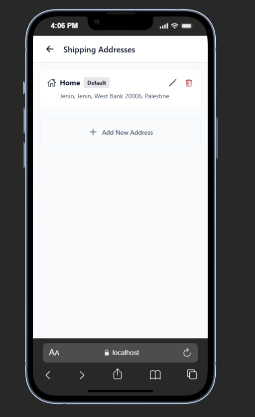 |

### Customer screens

- **Home:** Promotional carousel, category browsing, and thoughtfully chosen product recommendations.
- **Favorites:** Products saved to the customer's wishlist, with quick access to product details.
- **Cart:** Cart items, quantity controls, subtotal, shipping, total, and checkout action.
- **Profile:** Customer account information and links to orders, shipping addresses, reviews, and settings.
- **Product details:** Product imagery, maker information, price, size selection, shipping status, and add-to-cart action.
- **My Orders:** Previous orders with order number, date, payment method, status, items, and totals.
- **Shipping Addresses:** Saved addresses, default address status, editing, deletion, and adding a new address.

### Customer flow

```text
Home -> Browse/Search -> Product Details -> Add to Cart -> Checkout -> My Orders
  |                                                        |
  +-> Favorites ------------------------------------------+
  |
  +-> Profile -> Shipping Addresses / Reviews / Settings
```

> The **Admin Dashboard** is an internal management interface and is not part of the normal customer view. It is used separately for managing products and orders.

## Admin Dashboard

The admin interface is a separate role-based area for store management. It includes an overview dashboard, product management, product creation, and order management.

| Dashboard | Products | Add Product | Orders |
| :---: | :---: | :---: | :---: |
| 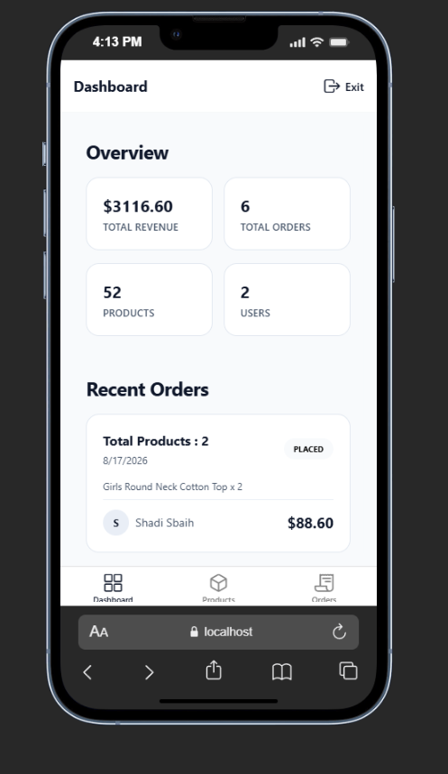 | 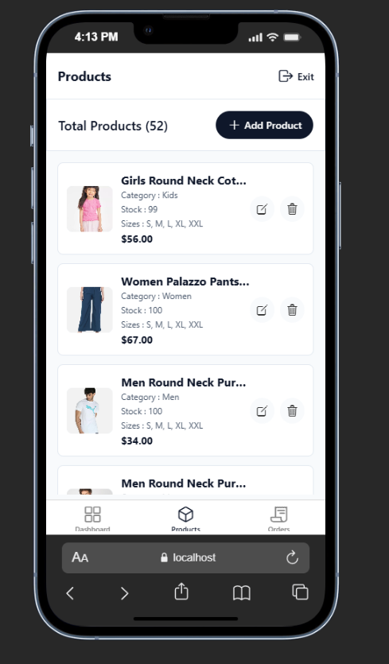 | 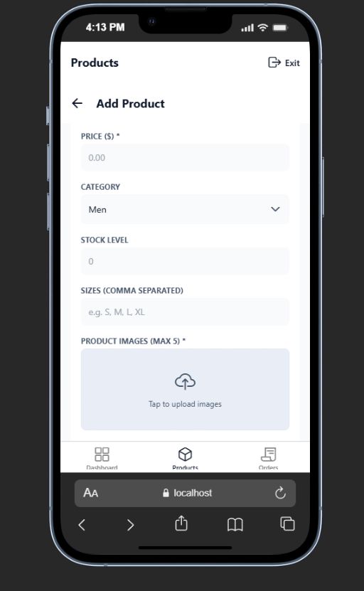 | 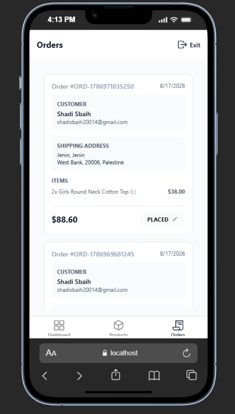 |

---

## 🚀 Getting Started

### Prerequisites
- Node.js (v18 or higher recommended)
- MongoDB Database (Local or MongoDB Atlas)
- Clerk Account (for authentication)
- Cloudinary Account (for image uploads)
- Expo CLI

### 1. Clone the repository
```bash
git clone https://github.com/your-username/ecommerce-app.git
cd ecommerce-app
```

### 2. Server Setup

Navigate to the `server` directory, install dependencies, and start the backend:

```bash
cd server
npm install
npm run server # Starts the dev server with Nodemon
```

### 3. Client Setup

Open a new terminal window, navigate to the `client-app` directory, install dependencies, and start the Expo development server:

```bash
cd client-app
npm install
npm run start
```

Press `a` to run on Android, `i` to run on iOS, or `w` to run on web.

---

## 🔑 Environment Variables

To run this project, you will need to add the following environment variables.

### Client (`client-app/.env`)
Create a `.env` file in the `client-app` folder:
```env
EXPO_PUBLIC_CLERK_PUBLISHABLE_KEY=pk_test_your_clerk_publishable_key
EXPO_PUBLIC_API_BASE_URL=http://localhost:5000/api # Adjust port if necessary
```

### Server (`server/.env`)
Create a `.env` file in the `server` folder:
```env
PORT=5000
MONGODB_URI=mongodb+srv://your_mongo_connection_string
CLERK_SECRET_KEY=sk_test_your_clerk_secret_key
CLERK_WEBHOOK_SECRET=whsec_your_svix_webhook_secret

# Cloudinary
CLOUDINARY_CLOUD_NAME=your_cloud_name
CLOUDINARY_API_KEY=your_api_key
CLOUDINARY_API_SECRET=your_api_secret
```

---

## 📂 Folder Structure

```text
📦 E-Commerce App
 ┣ 📂 client-app/        # React Native / Expo Frontend
 ┃ ┣ 📂 app/             # Expo Router screens & layouts
 ┃ ┣ 📂 assets/          # Local assets, images, fonts
 ┃ ┣ 📂 components/      # Reusable UI components
 ┃ ┣ 📂 constants/       # App constants, themes, colors
 ┃ ┗ 📂 Context/         # React Context (Cart, Wishlist, etc.)
 ┃
 ┗ 📂 server/            # Node.js / Express Backend
   ┣ 📂 src/             # Source files (Controllers, Routes, Models)
   ┣ 📜 server.ts        # Main entry point
   ┗ 📜 package.json     # Backend dependencies
```

---

## 🏗️ Build and Deployment

### Mobile (Client)
It is recommended to use **Expo Application Services (EAS)** to generate signed builds for app stores.
```bash
cd client-app
npx eas build --platform android
npx eas build --platform ios
```

### Backend (Server)
You can deploy the Node.js server to any platform that supports Node environments, such as **Render**, **Railway**, **Heroku**, or **Vercel**.
Ensure you set the appropriate environment variables in your hosting provider's dashboard.

---

## 🤝 Contributing
Contributions are always welcome! Feel free to open an issue or submit a pull request if you'd like to improve the app.
